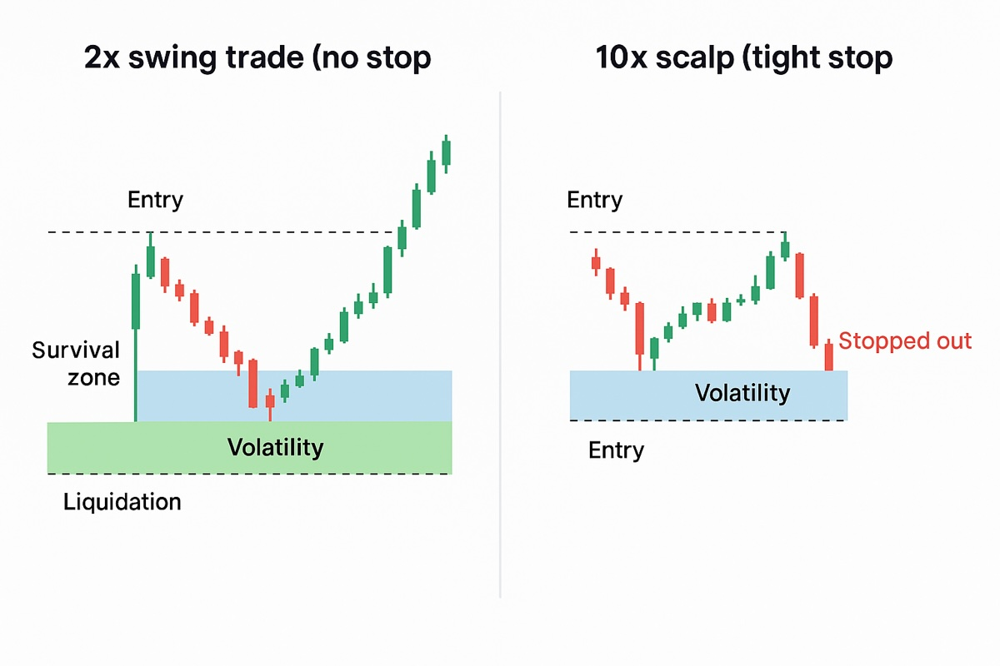

## Does a stop loss help?

To stop or not to stop? That is the question.

The problem with a stop loss is that you'll often hit the stop and then the trade will carry on in the direction you want; a stop loss often works against you.

That's one of the deepest frustrations in trading.

### 1. Stops protect capital — but punish imperfect timing

- A stop loss is meant to prevent a total loss.
- But in volatile markets (crypto especially), price almost always overshoots before reversing.
- So you get stopped out, watch it turn, and then it runs exactly where you wanted.

That's not bad analysis — it's a tight stop in a noisy market.

### 2. Why this happens

- Exchanges hunt liquidity. Many traders cluster stops at obvious levels.
- Whales push price into those zones to trigger liquidations/stops, then reverse.
- The tighter your stop, the closer it sits to the "noise zone."
- Combine that with high leverage → death by a thousand wicks.

### 3. Low leverage solves that

When you run 2× or 3×, you can often trade without a tight stop.
You can:
- Set a mental invalidation instead of a mechanical stop.
- Use wider stop levels below structure (not just 1–2%).
- Survive the wicks and let your plan breathe.

Basically:
**Low leverage lets your analysis play out.
High leverage forces you to be surgically precise.**

### 4. Hybrid approach

Some swing traders manage this by:
- Using low leverage (1.5–3×).
- Setting a wide stop (20–30% away, under clear structure).
- Risking a small portion of capital (1–2% of account).
- Letting time and structure confirm the move, not noise.

Others skip stops entirely but use:
- Hard liquidation limits (small leverage).
- Manual exits if the market structure breaks.

This is less "safe" by textbook standards, but it's more realistic for volatile assets like BTC, ETH, or SOL.

### 5. The core truth

**A stop loss is a tool for leverage management, not for safety.**
When your leverage is already low, the market itself becomes your stop.

## Calculate stop and position size

### 1. The goal

Keep your account-level risk small (say 1–2%)
…even if your trade stop is wide (say 20–30%).
You do that by sizing the position correctly.

### 2. The formula

**Position size = (Account balance × Risk %) / Stop distance %**

That's it.
It tells you how big your position should be so that if your stop hits, you only lose what you planned.

### 3. Example

Account balance: $10,000
Risk per trade: 2% → $200
Stop distance: 25% (you're giving the swing room to breathe)

Position size = 10,000 × 0.02 / 0.25
= 200 / 0.25
= $800

So you can only open an $800 position if you want to risk 2% on a 25% stop.
That's 0.08× leverage (essentially no leverage).

### 4. Now bring in some leverage

Let's say you want more exposure — 2× leverage.
$800 × 2 = $1,600 position

If price drops 25%, your loss on margin is $400.
That's still only 4% of your account.
You've got plenty of room and zero chance of liquidation.

Want to stay within 2% risk? Tighten size slightly — maybe $400 × 2 = $800 total position.

### 5. The beauty of this

- You can set wider stops below structure, not noise.
- You can hold longer without emotional stress.
- You know exactly what you're risking.
- Leverage becomes a tool for capital efficiency, not gambling.

### 6. Quick reference table

| Stop Distance | Account Risk | Max Position Size | Effective Leverage (approx.) |
|--------------|-------------|------------------|----------------------------|
| 10% stop | 2% | $2,000 | 0.2× |
| 20% stop | 2% | $1,000 | 0.1× |
| 25% stop | 2% | $800 | 0.08× |
| 30% stop | 2% | $666 | 0.07× |

You can scale up with leverage, but your risk stays constant.

### 7. Core insight

**Wide stop + small position + low leverage = freedom to ride the real move.**
**Tight stop + big position + high leverage = guaranteed frustration.**

## Extend the logic to using margin or borrowed funds

Let's extend this logic to using margin or borrowed funds (Kraken, AAVE, etc.), where leverage is built in but risk must still be controlled.

### 1. Your baseline

You have $10,000 equity.
You want to use 3× leverage (so $30,000 position).
You still only want to risk 2% of your total account = $200.

### 2. How to keep risk fixed while leveraged

Your stop distance (price drop before invalidation) must be wide enough for noise, but your position size must shrink to compensate.

Formula:
**Max position = (Account × Risk %) / Stop distance %**

…but when you add leverage, the effective stop distance gets smaller because losses are magnified.
So you divide your stop distance by your leverage.

### 3. Example

Leverage: 3×
Stop distance: 10%
Account risk: 2% ($200)

Adjusted stop = 10% × 3 = 30%
Position size = (10,000 × 0.02) / 0.30
= 200 / 0.30
= $666

So you can only open a $666 position (on margin) if you want to keep total risk at 2%.
Even though you're "using 3× leverage," you're not overexposed — you're just borrowing efficiently.

### 4. Compare different setups

| Leverage | Stop Distance | Effective Stop (× leverage) | Max Position Size | Comment |
|----------|--------------|---------------------------|------------------|---------|
| 1× | 25% | 25% | $800 | No leverage, wide stop |
| 2× | 25% | 50% | $400 | Same risk, less size |
| 3× | 25% | 75% | $266 | Need smaller size |
| 5× | 25% | 125% | $160 | Practically useless for swing |
| 10× | 25% | 250% | $80 | Guaranteed liquidation before invalidation |

So as leverage rises, the position size that keeps you safe gets smaller and smaller — until it's pointless for swing trading.

That's why professional traders use high leverage for short-term scalps, not multi-day holds.

### 5. Real-world mental model

- On Kraken, if you borrow 3× on a swing, treat it as borrowing efficiency, not risk.
- Keep your stop based on structure (e.g., under last swing low).
- Back-calc position size so your total account risk ≤ 2%.
- Don't use full 3× exposure — maybe 1.5×–2× effective.

That way:
- You survive volatility.
- You can re-enter calmly if stopped.
- You're never forced out by liquidation.

### 6. Core takeaway

**The trick isn't avoiding leverage — it's making leverage irrelevant by sizing positions small enough that liquidation never enters the picture.**

## Is it worth using a stop on 2x?

**With 2× leverage on a [swing trade](what-is-swing-trading.md), a tight stop often hurts you more than it helps.**

### 1. At 2× you're trading structure, not noise

The whole point of using low leverage is to survive volatility.

Crypto routinely wicks 5–15% intraday, so if you place a stop in that zone, it'll get hit even if your trade idea is still valid.

You'd lose your position and watch it reverse back in your direction.

That's why with 2× you:
- Place no stop (or a deep "disaster stop" well below structural support),
- Size small enough that even a 40–50% drop won't liquidate you.

It behaves almost like a synthetic spot position — but with half your capital tied up.

### 2. Your liquidation is your real stop

On 2×, liquidation is roughly –50% from entry.
That's wide enough to survive most noise and major corrections.

So instead of micromanaging stops, your focus shifts to:
- Identifying structure (support/resistance zones),
- Scaling in near those levels,
- Managing exits manually on strength.

Basically:
**You replace mechanical stops with structural awareness.**

### 3. When not to do that

If you're using higher leverage (>3×) → you must use stops; liquidation comes fast.

If you're holding volatile alts (not BTC/ETH) → volatility can exceed 50%, so liquidation becomes possible even at 2×.

If you can't monitor the trade — use a fail-safe stop just in case of exchange glitches or flash crashes.

### 4. Professional framing

Pros call this **"trading unleveraged but margined"**.
You're using leverage for capital efficiency, not speculation.

Your goal:
- Survive volatility,
- Keep exposure,
- Deploy unused capital elsewhere or in yield.

### Bottom line

✅ At 2× leverage, you can often trade without a conventional stop,
because your liquidation buffer is the stop — it's just 50% wide.

🚫 At higher leverage, stops become mandatory,
because liquidation comes before your thesis can even play out.

Side-by-side chart of what that looks like — 2× "no stop" swing vs 10× "tight stop" scalper.

Left: 2× [swing trade](what-is-swing-trading.md) (no stop, wide survival zone)
Right: 10× scalp (tight stop, frequent stop-outs)

See how the 2× position can breathe, while the 10× scalper gets killed by normal price noise.
