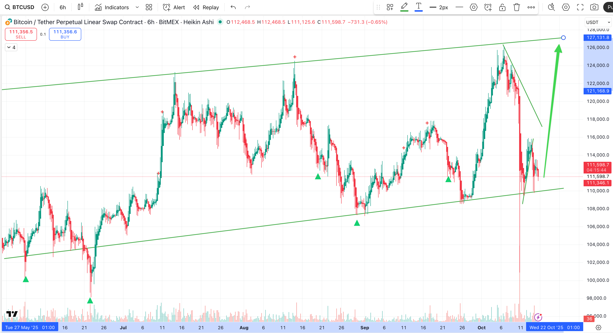

# Four Bitcoin mindsets: which game are you playing?

*Understanding your relationship with Bitcoin isn't just about strategy—it's about knowing your timeline, goals, and what success looks like for you.* The same price movement can represent opportunity or threat depending entirely on which mindset you're operating from. Each approach requires different decisions, different risk tolerance, and fundamentally different ways of thinking about the asset.

## 🚨 Quick reference

**Four fundamental mindsets:**

| Mindset | Goal | Timeline | Exit strategy | Risk level |
| :--- | :--- | :--- | :--- | :--- |
| Investor | Accumulation | Indefinite (years) | Never sell, borrow against | Low (hold through volatility) |
| Speculator | Capital growth | Defined (3-12 months) | Exit at swing high | Medium (time-constrained profit) |
| Trader | USD accumulation | Tactical (days to weeks) | In and out at key levels | High (timing-dependent) |
| Accumulator | Bitcoin stack growth | Long-term (years) | Sell high, buy more low | High (timing + conviction required) |

**Critical insight**: Your mindset determines your actions. The investor holds through 30% drops. The speculator exits at the swing high regardless of further upside. The trader cares only about USD profit, not Bitcoin accumulation. The accumulator trades volatility to increase their Bitcoin position.

## The investor mindset: never sell

The investor operates with a singular conviction: Bitcoin's long-term value proposition far exceeds any short-term price movement. If you believe Bitcoin will reach a million dollars by 2030, selling at any point below that is forfeiting future gains for present liquidity.

This mindset requires deep conviction in Bitcoin's fundamental thesis—whether that's sound money, digital gold, inflation hedge, or some combination. The investor doesn't care if Bitcoin drops 40% next month because they're measuring success over years, not weeks. Price volatility isn't risk; it's noise.

### The borrow-against strategy

When Bitcoin appreciates significantly, the sophisticated investor doesn't sell—they borrow against it. This is the key strategy that allows them to access capital while maintaining full exposure to future upside.

Here's how it works in practice: Your Bitcoin has appreciated 50% and you need capital for a business opportunity or living expenses. Instead of selling and triggering a taxable event while forfeiting future gains, you take out a loan using your Bitcoin as collateral. A typical loan-to-value ratio might be 40%—if you have $100,000 in Bitcoin, you can borrow $40,000 in USD or stablecoins.

You keep your Bitcoin. You keep your exposure to future price appreciation. You also have liquid capital to deploy immediately. Yes, there's interest to pay, but if Bitcoin continues appreciating at historical rates, the cost of the loan is far less than the opportunity cost of selling.

This requires using the right lending services—established platforms with reasonable rates, transparent terms, and strong security practices. It also requires discipline around loan-to-value ratios. Going too high (above 50-60%) puts you at risk of liquidation if Bitcoin drops sharply. Conservative investors stay around 30-40% LTV, giving them substantial buffer against volatility.

The investor accepts that this approach means never realizing traditional "profits." They're playing an infinite game where Bitcoin itself is the measure of wealth, not its USD equivalent. The goal isn't to cash out—it's to never need to.

## The speculator mindset: defined timeline

The speculator has a fundamentally different relationship with Bitcoin. They have a timeline—perhaps six months, perhaps a year—and a clear purpose for the capital at the end of that period. Maybe interest rates are expected to drop next year, making real estate attractive. Maybe a business opportunity requires capital in nine months. Whatever the reason, this is speculative capital with an expiration date.

This changes everything about how you interact with price movements. The speculator isn't trying to hold forever; they're trying to maximize capital growth within a specific window, then exit with profits secured. They're not interested in Bitcoin's ten-year trajectory—they're interested in catching a favorable swing within their timeframe.

The speculator watches for the next significant swing high within their window. When Bitcoin runs from $65,000 to $85,000 over three months, that might be the exit—regardless of whether Bitcoin could potentially reach $100,000. Why? Because the speculator is prioritizing safety and certainty over maximum potential gain. They're locking in a 30% gain rather than risking a reversal that could eat into their profits and jeopardize their timeline.

This approach requires accepting that you'll leave money on the table if Bitcoin continues rising after you exit. That's not a failure—it's the cost of having a defined goal and timeline. The speculator who exits at $85,000 and watches Bitcoin climb to $100,000 hasn't made a mistake; they've executed their plan successfully. They prioritized securing capital for their defined purpose over chasing maximum gains.

This mindset requires discipline to resist FOMO when prices keep rising after your exit. It also requires accepting medium-term volatility risk—if Bitcoin drops 25% halfway through your speculation window, you might be holding at a loss with time running out. The speculator takes on time constraint risk that the investor completely avoids by having no exit timeline.

## The trader mindset: USD accumulation

The trader thinks in fundamentally different terms than either the investor or speculator. They don't measure success in Bitcoin accumulated or percentage gains—they measure success in USD profit extracted from volatility. The trader starts in USD, enters Bitcoin positions at key technical levels, and exits back to USD when those positions hit profit targets. Bitcoin is an instrument, not an asset to hold.

This is the highest-intensity approach. The trader identifies support and resistance levels, watches for test-and-hold patterns or rejection signals, and takes positions sized according to risk-reward at that specific level. When Bitcoin drops to a major support level and shows strong buying with multiple lower wick tests, the trader enters a long. When price reaches resistance or shows distribution, they exit back to USD—whether that's hours, days, or weeks later.

The trader stays primarily in stablecoins or USD equivalents, treating these as the "safe" base position. Bitcoin exposure is tactical, temporary, and sized according to the technical setup quality. A high-probability test at a major support level might warrant a larger position. A marginal setup might get a smaller allocation or be passed entirely. Risk management is paramount—stops are placed, position sizing is calculated, and no single trade can destroy the trading capital.

This approach requires constant attention to price action, technical analysis skills, and emotional discipline to execute exits even when price action suggests further upside. The trader who exits their long at a 10% gain doesn't care if Bitcoin runs another 15%—they extracted their USD profit and moved back to safety. They're playing a different game entirely, one where the goal is consistent USD accumulation through repeated tactical positions, not maximum appreciation of a held asset.

The trader accepts high-frequency decision making, fees from entering and exiting positions, and the psychological pressure of timing markets. In exchange, they maintain flexibility to be in USD during major corrections and to size positions according to opportunity quality rather than being always-long with no flexibility.

## The accumulator: hybrid approach

There's a fourth mindset that combines elements of the investor and trader: the accumulator. This person believes in Bitcoin's long-term thesis like the investor but actively uses volatility to increase their Bitcoin stack rather than their USD balance.

The accumulator sells a portion of their Bitcoin during euphoric rallies and aggressive run-ups, then buys back more Bitcoin during corrections and capitulation events. They're not trying to accumulate USD—they're trying to accumulate sats (satoshis, the smallest Bitcoin unit). A successful accumulator trade means exiting at 1.5 BTC during a rally and re-entering at 1.7 BTC during the correction, netting 0.2 BTC regardless of USD price movement.

This requires exceptional timing, strong emotional control to sell during euphoria and buy during fear, and acceptance that you might sell too early or buy too late. It also requires maintaining a core position that never gets traded—perhaps 60-70% of holdings stay untouched while 30-40% is used for accumulation trading. This protects against the catastrophic error of selling everything before a major sustained rally.

The accumulator's measure of success is simple: Do I have more Bitcoin than I started with? They've hybridized the investor's conviction in Bitcoin's long-term value with the trader's active management of positions. It's a sophisticated approach that works best for those with strong technical analysis skills and high risk tolerance.

## Choosing your mindset

Your mindset should be chosen deliberately, not inherited by default. Most people drift into one approach without consciously deciding if it matches their goals, timeline, and psychological makeup.

**Choose investor if**: You have multi-year conviction in Bitcoin's thesis, don't need liquidity in the foreseeable future, and can psychologically handle 40-50% drawdowns without panic. This is the lowest-stress approach but requires the deepest conviction and longest timeline.

**Choose speculator if**: You have a specific timeline and capital need, want to participate in Bitcoin's potential upside during that window, and can accept leaving gains on the table after exiting. This balances participation with defined outcomes but introduces time-constraint risk.

**Choose trader if**: You have strong technical analysis skills, can handle high-frequency decision making, want to extract consistent USD profits from volatility, and are comfortable with the psychological demands of timing entries and exits. This is the highest-maintenance approach but offers the most tactical flexibility.

**Choose accumulator if**: You have long-term Bitcoin conviction like the investor but want to use volatility to increase your stack, have strong timing skills, and can handle the emotional difficulty of selling during euphoria and buying during fear. This is the most sophisticated approach, requiring skills from both investing and trading.

None of these approaches is inherently superior. The investor who holds through multiple cycles and borrows against their Bitcoin can achieve exceptional wealth if their thesis is correct. The trader who consistently extracts 2-3% USD gains from volatility can compound capital effectively. The speculator who times their defined window well can achieve their goals while limiting downside risk. The accumulator who successfully grows their stack through cycles can outperform all others in Bitcoin terms.

## Mixing mindsets causes mistakes

The most dangerous thing you can do is mix mindsets within the same capital. Using investor capital with trader decisions—holding too long after entry signals resolve or panic selling during normal volatility—destroys the advantage of both approaches. Using trader capital with investor psychology—refusing to exit because "Bitcoin will be higher eventually"—turns tactical positions into forced long-term holds after losses.

Decide your mindset for each pool of capital, then execute that approach consistently. If you have both investor and trader capital, keep them completely separate. Your cold storage Bitcoin that you'll borrow against in five years should never be touched by trading decisions. Your trading capital in stablecoins should never be deployed based on long-term Bitcoin thesis—only on technical setups with clear entries and exits.

This clarity about mindset and consistent execution within each framework is what separates successful participants from those who get chopped up by the market. Know which game you're playing. Play that game well. Don't confuse one game's rules with another's.
