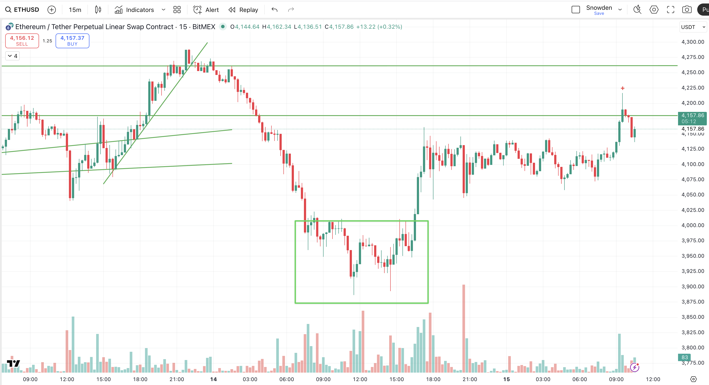
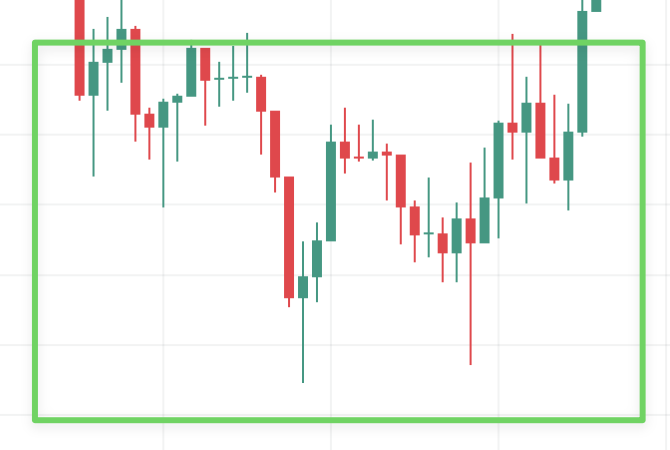
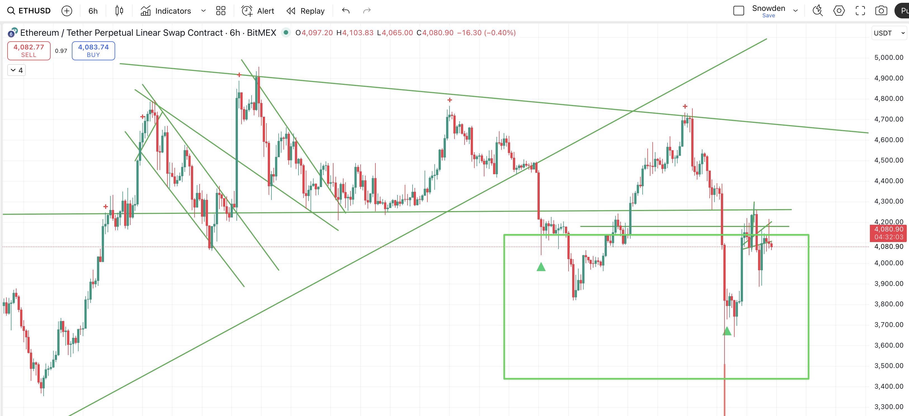
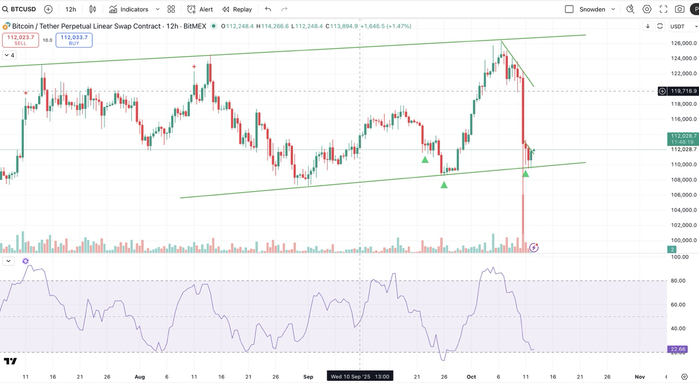
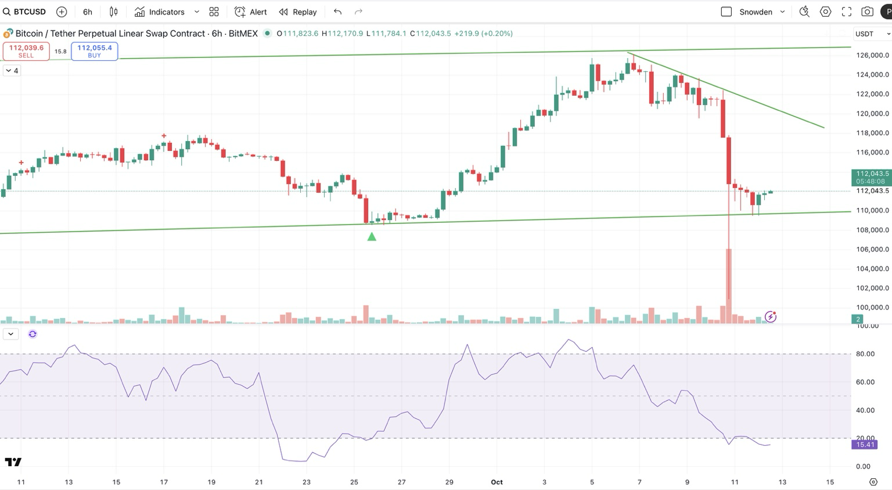
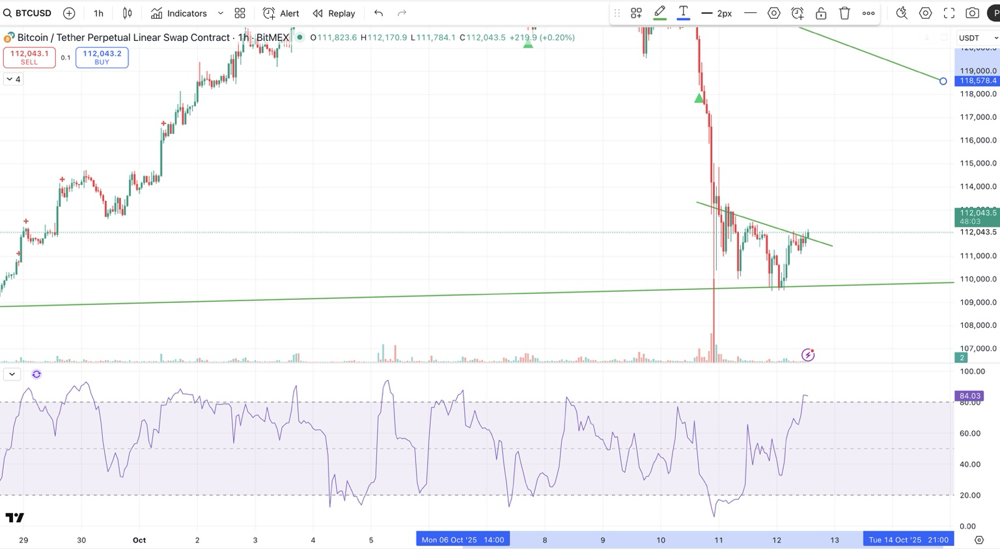
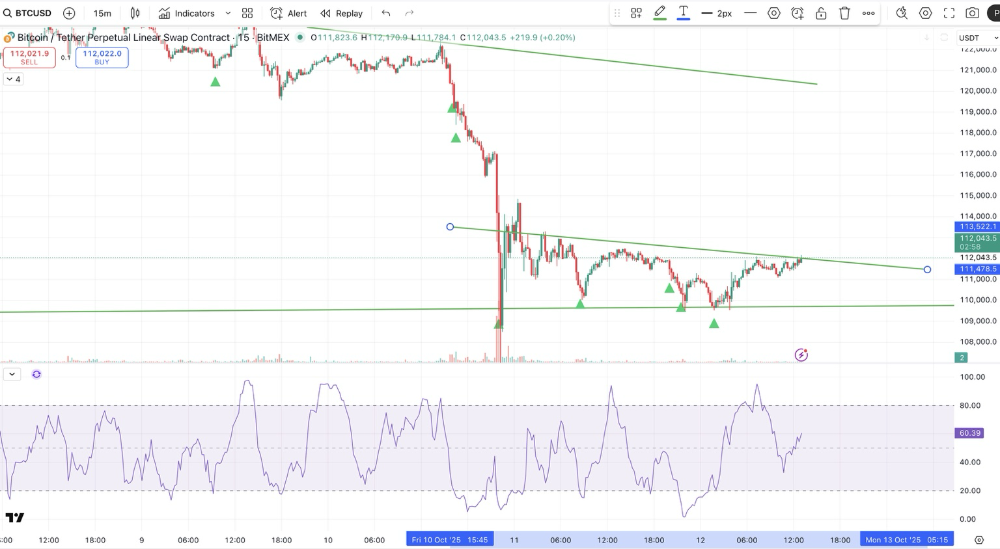

# Reading price test and hold patterns with long lower wicks

## What is a "test and hold"?

When price enters a support zone , you don't want to buy the instant it touches. You want evidence that buyers are defending that level.

### Three key components

**1. Test and hold**

- Price drops into the support zone
- Instead of continuing straight down, it bounces back up one or more times
- Each time it dips into that zone, it fails to close candles below it
- That's the "hold" — support is being respected

**2. Long lower wicks**

- On those candles, the body (the thick part) is small, but the wick below is long — like a hammer shape
- This shows sellers pushed price down, but buyers stepped in and drove it back up before the candle closed
- Multiple long wicks in a row = absorption — buyers soaking up the selling pressure

**3. RSI turning up from sub-20**

- RSI dipping under 20 means the move is extremely oversold
- When it curves up and crosses back above 20–30, momentum is shifting
- Combined with long wicks, this is your entry signal that the low is likely in

### The pattern in simple terms

Watch for candles that probe down into support, get rejected hard, and close higher, while RSI begins to recover.

**That's when it's worth entering your 2× long** — not while it's still free-falling into that zone.

## Range context: Where are the wicks appearing?

The same lower wick pattern has completely different meanings depending on where it appears in the recent price structure. This is the difference between high-probability reversals and false signals.

### The range context problem

**Without range context:**
- Lower wicks could appear anywhere (mid-range, top, random)
- Equal technical signal, but vastly different probability outcomes
- You're just pattern-matching without strategic context

**With range context:**
- Lower wicks at **bottom of range** = buyers defending key level (bullish reversal)
- Lower wicks at **top of range** = likely failed breakout, continuation down (bearish)
- Same pattern, completely different meaning

### Where to look for high-probability setups

Lower wicks are most significant when they appear:

**Near recent swing lows**
- Look back 5-7 days for crypto (3-4 weeks for stocks)
- This is your key support level
- Lower wicks testing this level = buyers defending structure

**At the bottom 25% of the weekly range**
- Defines current market structure
- Bottom quarter = reversal territory
- Top quarter = potential exhaustion or failed breakout

**At previously tested support levels**
- Multiple tests = stronger support
- First test = higher risk, needs more confirmation
- Third+ test with volume decline = accumulation

### Practical lookback periods

For the 6H timeframe swing trading approach:

**Primary lookback: 5-7 days (120-168 hours)**
- Captures recent swing structure
- Identifies key support/resistance zones
- 20-28 candles on 6H chart

**Secondary context: Weekly range**
- Where are we in this week's high-low range?
- Bottom 25% = reversal zone
- Above 50% = different context

**Avoid: 24-hour range**
- Too short for swing decisions
- Creates noise on 6H timeframe
- Better for intraday/scalping

### Distance from swing low matters

**Within 2-5% of recent swing low:**
- Very relevant support test
- High probability setup
- Strong buyer interest expected

**Within 10% of recent swing low:**
- Somewhat relevant
- Needs additional confirmation
- Watch for divergence signals

**Beyond 10% from swing low:**
- Different context entirely
- May be mid-range consolidation
- Lower probability reversal

### Key question before entry

Before entering on lower wicks, always ask:

**"Where is the recent swing low, and how close are we to it?"**

If you can't identify a clear recent low being tested, the lower wicks are likely mid-range noise, not a reversal signal.

## How many tests signify strength?

You're looking for evidence of accumulation, not just a random bounce.

### One test = reflex bounce

- Often just short covering or a relief move
- Price may still roll over and retest the lows
- RSI rises fast but without structure
- **Not reliable for swing entry**

### Two tests = potential base

- Price rejects the same zone twice (a double bottom) with long wicks both times
- RSI forms bullish divergence — higher lows while price stays flat or lower
- This means sellers are losing strength
- **First real sign of buyers absorbing supply**

### Three or more tests = accumulation

- You'll see 3–5 dips into the same support area over several hours or candles
- Each one has long wicks but closes higher or equal
- Volume gradually declines on each sell-off (selling exhaustion)
- RSI flattens and starts trending upward
- **This is strong — high probability of a move up next**

### Test strength comparison

| Number of tests | Meaning | Strength |
| :--- | :--- | :--- |
| 1 | Reflex bounce | Weak |
| 2 | Double bottom / forming base | Moderate |
| 3+ | Accumulation / strong defense | High |

### Simplified timeframe rule

- **6H / 4H** — Define the zone
- **1H** — Confirm buyers are defending it
- **15m** — Trigger the entry when the wicks and RSI line up

## Why 6H matters for confirmation

Each 6H candle compresses a lot of noise — it takes real volume and time for a wick to form at this timeframe. When you see multiple long lower wicks into the same zone on 6H, that means buyers have defended that price level for a full day or more.

**Three solid 6H rejections = institutional accumulation, not just retail noise.**

### What to look for on each test

| Candle | Signal | Meaning |
| :--- | :--- | :--- |
| 1st test | Big red candle with a long lower wick | Panic sell / liquidity grab |
| 2nd test | Another drop to same level but closes higher | Sellers fading, buyers soaking up |
| 3rd test | Long wick again, small body or green close | Supply exhausted, base complete |

### RSI confirmation checklist

- Hit oversold (<25) on first test
- Make higher lows on 2nd and 3rd tests (divergence)
- Start curling up towards 40

## Candle types: use ordinary candles, not Heikin Ashi

You always want to read wicks on ordinary (Japanese) candles, not Heikin Ashi.

### Why Heikin Ashi distorts wick signals

**Heikin Ashi smooths data**
- HA candles are averaged — they blend open, close, high, and low from neighbouring candles
- That makes trends look smoother but distorts true highs and lows
- A long HA wick might not exist on real price — it's synthetic

**Regular candles show true order flow**
- The wick shows exactly where price traded
- When you see a long lower wick, you know buyers actually stepped in and pushed price back up
- That's the raw supply–demand signal you want for "test and hold" analysis

### Best workflow

- **Use regular candles** for structure, wicks, and support/resistance analysis
- **Use Heikin Ashi** for trend clarity — to smooth out noise once you're already in a position

### Example combination

- **6H Japanese candles** — Find support and test wicks
- **15m Heikin Ashi** — Time entry once structure turns green (momentum shift)

## Choosing the right timeframe

### For accuracy of signal (strength of support)

**Use 6H**
- Each candle captures half a day of trading, so wicks here mean real defense by buyers
- Three long lower wicks on 6H = strong institutional accumulation
- Best for swing trades (holding 1–3 days or more)
- **This is your main timeframe for confirmation**

### For more entries and faster confirmation

**Use 4H**
- Slightly more reactive, still reliable
- Often gives early confirmation before 6H prints its second or third wick
- Use it to watch momentum shifts (RSI, MACD crosses)

### For timing your entry precisely

**Use 1H**
- Shows the fine detail of how support is being defended
- You'll see hammer candles and bullish divergences form here first
- Ideal for watching the "test and hold" pattern in real time

### Timeframe workflow

| Purpose | Timeframe | What you're doing |
| :--- | :--- | :--- |
| Identify support zone | 6H | Define buy zone |
| Confirm accumulation | 4H | Watch for 2–3 wick tests, RSI divergence |
| Trigger entry | 1H | Enter on bullish engulfing or breakout candle |

**In short:**
- Use **6H** for the big picture
- **4H** to confirm strength
- **1H** to actually pull the trigger

## Focus on 6H for structure formation

The 6H timeframe is exactly where you want to be focused for catching swing reversals.

### 6H = structure in motion

- It's the sweet spot between noise and lag
- You can actually see the structure forming — the wick tests, RSI turns, and volume shifts — all within 1–2 days
- That's where your "test and hold" will appear first
- **Watch the 6H closely**

### 1D (Daily) = confirmation of structure

- The daily candle will only confirm after the 6H has done its work
- By the time you see a strong bullish daily close, you'll already be halfway through the move
- **Use it to confirm, not to enter**

### 1W (Weekly) = macro bias

- This gives you your trend context, not your trade setup
- The weekly tells you whether you're counter-trend or with the larger move
- **Provides the bigger picture for risk assessment**

### Multi-timeframe framework

| Purpose | Timeframe | What to watch |
| :--- | :--- | :--- |
| Identify exact structure | 6H | Wick tests, RSI divergence, hold above trendline |
| Confirm reversal | 1D | Strong close above 113–114k |
| Check macro bias | 1W | Trend direction, EMA slope |

### Summary: 6H entry checklist

Stay zoomed in on 6H until you get:

1. Two long-wick holds near 110k–111k
2. RSI starting to rise from 20
3. Volume calming down

**Then check daily to confirm a higher close. That's your signal the bottom's real — not just noise.**

## The 12H secret: the bridge timeframe

The 12H chart is one of the best-kept secrets in trading. Most people skip it, but experienced traders use it for clarity between daily and intraday timeframes.

### 12H = the bridge between 6H and 1D

- It smooths out the noise of the 6H but reacts twice as fast as the daily
- It captures both Asia + US session flows in one candle — so it reflects global sentiment better
- If you see structure forming on 6H and it's confirmed on 12H, that's a very reliable signal

### The complete timeframe hierarchy

| Timeframe | Use | What it tells you |
| :--- | :--- | :--- |
| 6H | Entry timing | Shows wick tests and first signs of buyers stepping in |
| 12H | Structure validation | Confirms whether those tests are holding and forming a true base |
| 1D | Confirmation | Tells you the swing is locked in (but usually too late to enter) |

### Summary: the three-stage validation

- **6H** = where structure emerges
- **12H** = where structure validates
- **1D** = where structure confirms

## Real example: confirmed test and hold setup

**12H** — Clear bounce off the trendline with long lower wicks. RSI curling up from oversold (~22).

**6H** — Higher low forming, RSI turning up from 15. Volume drying = sell pressure fading.

**1H** — Breaking minor descending trendline. RSI > 70 = short-term momentum return.

**15m** — Multiple tests of 110–111k, all held. Buyers defending the zone.

### Interpretation: this is a confirmed "test and hold"

The confluence (multi-timeframe support + RSI divergence + reclaiming structure) makes a 2× long entry logical here — especially if you're treating it as a swing position with a wide stop (or no stop).

**Entry zone:** 111.5–112k

**First target:** 118.5k (previous structural high)

**Second target:** 121–122k (top of descending resistance)

**Invalidated below:** 109.5k close on 6H (structure break)

### Tactical note: managing a 12H structure trade

Because this is a 12H structure trade, not a scalp:

- Don't overmanage it intraday
- Watch the 6H candles — if they print long lower wicks again on any retrace, that confirms buyer strength
- RSI on the 12H crossing 30 would be your next green light for scaling in further
