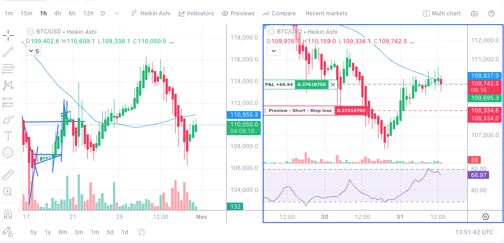
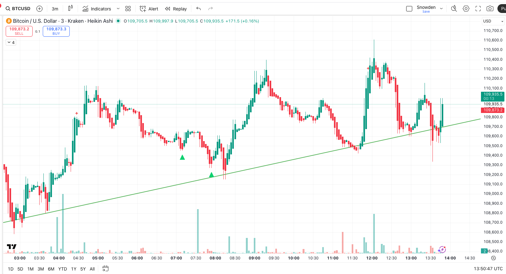

# The trade window

## Original insight (the seed idea)

**The problem:** Trading a large position (e.g., $50k on 3X leverage) can cost you $100 in fees, spread, and slippage just to get in and out. You need to make $200 before you even profit! Death by a thousand cuts happens when you take too many trades in choppy conditions — fees eat your edge alive.

**The solution:** Identify optimum times to take trades where you can stay out of trouble and put the odds in your favor.

**6H & 1H Heikin Ashi shows the direction of the trend**

**Take trades inside the upwards trend as a rising tide lifts all ships**

**The framework:**

1. **Trade context (higher timeframe):** Use a wider timeframe — e.g., 6H Heikin‑Ashi — to spot the trend and see how far price has moved from its average. This lets you see when price is likely to bounce back to normal levels and gives you clear market context and directionality.

2. **Trade window (safe container):** Take trades only inside a safe container that has a higher probability of trending in one direction or the other — a defined period where chart patterns, momentum, and price position all line up.

3. **The goal:** Stay out of chop, avoid fees, and stop getting chopped to death. Trade fewer times, but trade when the odds are genuinely in your favor.

## What is the trade window?

The "Trade Window" is a timing framework used by professional traders to restrict trade-taking to discrete periods inside a larger trend where the odds of directional follow‑through are elevated and trading costs are minimized.

**Think of it as a pressure corridor or wave pocket inside the market's larger motion: if you only trade inside that corridor you avoid a lot of chop, fee death, and low-expectancy setups.**

## Why it works

The trade window concept works because it combines three powerful advantages:

**1. Concentrates trades into high-probability periods**

Instead of trading constantly, you only trade when conditions favor continuation. This means higher win rates and better average wins because you're entering when momentum is most likely to persist.

**2. Reduces the fraction of trades taken in chop**

Choppy, neutral, or low‑edge conditions kill win rates and increase frictional losses (fees, spread, slippage). By staying out during these periods, you preserve capital and avoid the psychological drain of constant small losses.

**3. Makes execution more predictable**

When you only trade inside the window, the price action is more consistent. You can use tighter stops, better entry timing, and clearer targets because the market behavior is more predictable.

**Analogy:** The trade window is a pressure corridor — entering during expansion inside the corridor gives you room for momentum to accelerate; entering outside it is like trying to push against static water.

## How to identify a trade window

A trade window exists when these conditions align:

**Higher-timeframe bias is clear**

Use a wider timeframe (like 6H Heikin‑Ashi charts) to identify the direction of the trend. Is it clearly up, down, or mixed? Only trade when the bias is obvious.

**Price has room to move**

Check how far price has moved from its average. If it's too close to average, there's no momentum yet. If it's too far away, it might snap back. You want the middle zone — enough movement to show momentum, but not so far that it's exhausted.

**The market is ready to move**

Look for periods where the market has been quiet (tight range) and is starting to break out. Avoid trading when price is going nowhere — that signals the move is dying.

**Chart pattern is clean**

On your execution timeframe, candles should show clear direction, not messy overlapping bars. Clean patterns mean price is moving decisively in one direction, not bouncing back and forth.

## The core principle

**Trade fewer times, but trade when conditions genuinely favor you.**

Most losing traders do the opposite: they trade constantly, hoping to catch something. Winners wait for the setup to come to them — when the higher timeframe shows clear direction, price has room to move, and the chart confirms momentum.

## Quick rules of thumb

- Let the higher timeframe be the referee — if the trend isn't clear, don't trade.
- Only take trades when price has moved away from average but isn't at extremes.
- Wait for a quiet period followed by a breakout — that's your signal.
- Avoid trading when the market is choppy or sideways on higher timeframes.
- Prefer fewer, larger trades over many small trades that get eaten by fees.

## Real-world example

**BTC trade inside the window:**
- 6H timeframe shows clear uptrend (green candles, price above average)
- Price has pulled back slightly but isn't at extreme levels
- 15m shows a narrow range followed by a strong breakout candle
- Result: clean momentum leg, profitable trade

**Same setup outside the window:**
- 6H timeframe is mixed (no clear direction)
- Breakout looks similar on 15m but quickly reverses
- Result: frequent stop-outs, many small losses, fees eat profits

The same trigger behaves completely differently depending on whether you're inside or outside the trade window.

## Is this a well-known strategy? Do traders actually do this?

The trade window concept combines several well-established trading principles that professional traders use, but the specific framework as presented here is more of a systematic formalization rather than a single "named" strategy.

**What's well-known and widely used:**

1. **Multi-timeframe analysis** - Very common. Traders routinely use higher timeframes for bias and lower timeframes for entries.

2. **Heikin-Ashi for trend identification** - Popular among swing traders and position traders. It's built into most trading platforms specifically because traders use it.

3. **Trading with the trend** - "The trend is your friend" is trading 101. Most successful traders prefer trending conditions over chop.

4. **Volatility compression → expansion** - Well-documented pattern. Many professional traders wait for compression then trade the breakout (Bollinger Band squeezes, etc.).

5. **Fee-aware trading** - Institutional and professional traders are obsessive about execution costs. Retail traders often ignore this until it kills their account.

**What's less formalized:**

The specific "trade window" framing - the idea of explicitly defining a container of conditions and *only* trading inside it - is less common as a named concept. Most retail traders either:
- Trade too much (every setup they see)
- Follow mechanical signals without context
- Use discretionary judgment but without systematic filters

**Who does this:**

- **Institutional traders** use similar frameworks (market regime filters, volatility regimes, execution timing)
- **Systematic/algorithmic traders** build exactly these kinds of multi-condition filters
- **Experienced discretionary traders** internalize these concepts but may not articulate them this way

**Bottom line:** The individual components are well-known. The discipline of combining them into a strict "window" and trading *only* when all conditions align is what separates professionals from amateurs. Most losing traders know these concepts but lack the discipline to wait for the full setup.

*The goal: trade less, trade only when the structure gives you real edge.*
