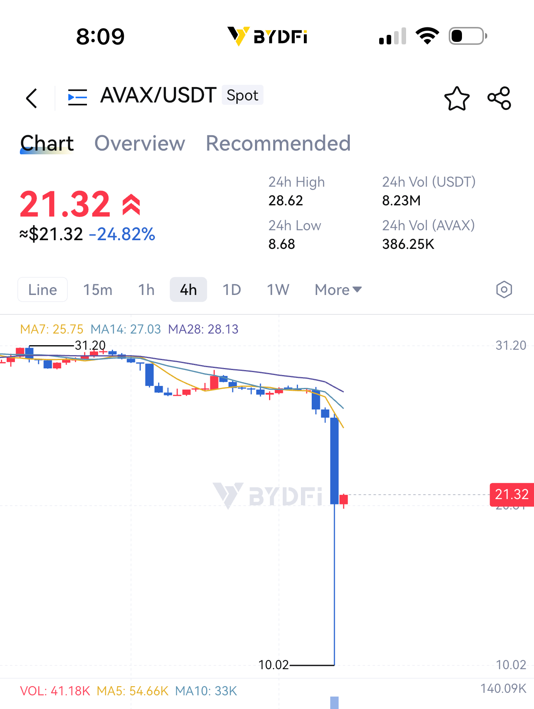

# Stop losing everything: The truth about leverage and time

### Are you using high (10X+) leverage for *everything*?
Stop it right now. *Seriously.*
You're going to lose *all* your money over time.
Read below to find out why.

Note: This is a conversation I (Mike) had with ChatGPT 5 about why I kept losing money with leverage and what to do about it. The answers are ChatGPT, however I've reviewed and updated them to match my understanding about the best times to use high and low leverage. I also guided the direction of the conversation. Please click on the blue links to explore subjects in more detail.

--

## The core insight

Let's nail the core insight most traders only learn after being liquidated a few times.

**The main idea:  Leverage should go up with certainty and down with time.** You can safely use more leverage the more sure you are about a trade, as long as the entry is tight, the invalidation is clear, and the time frame is short.

The more time you have to hold on, the more time makes you vulnerable and fragile.  **Every extra hour in a high-leverage position gives randomness another chance to kill you, even if your directional thesis is right.**

Markets are always chopping, wicking, and retracing.  **High leverage makes normal noise into liquidation events.  Low leverage gives you the space you need to ride out volatility and let your edge show.**  Don't base your leverage on how much money you want to make; instead, base it on how sure you are and how long you have to wait.

Let's break it down cleanly:

## Death by a 1000 chops

### 1. Leverage amplifies exposure and fragility

- 10× leverage means a **10% move against you wipes you out**.
- 2× leverage means you can survive a **50% swing** and still be in the game.
- So high leverage isn't just "more risk," it **shrinks your [margin for noise](margin-for-noise.md)**.

### 2. Volatility = death by chop

- Markets *rarely* move in straight lines — even a strong trend retraces 20–30%.
- With high leverage, those retraces liquidate you before the move resumes.
- [Swing trades](what-is-swing-trading.md) last days or weeks → **plenty of time for volatility to shake you out**.

### 3. Time magnifies random variance

- Each hour or candle adds another chance for a stop-out.
- Even if your direction is right, the longer you're in, the higher the odds of a random spike killing your position.
- That's why it's important to bear in mind that **time works against high leverage**.

### 4. Use leverage like a scalpel

- High leverage makes sense only when:
  - You're trading a short, clearly defined move.
  - You have a tight invalidation point (you know where you're wrong).
  - You can monitor the trade actively.
- Then, leverage boosts efficiency — not risk.

### 5. Low leverage gives you breathing room

- For [swing trades](what-is-swing-trading.md), low leverage (1.2×–2×, 3x if using margin) lets you:
  - Survive volatility.
  - Hold through consolidations.
  - Manage trades without glued-to-screen stress.
- It also keeps liquidation far from your stop, so your stop loss — not the exchange — decides when you're wrong.

### 6. Mental game

- High leverage breeds anxiety → bad decisions → early exits or revenge trades.
- Low leverage keeps your psychology calm. You can hold conviction, follow structure, and execute your plan.

**Rule of thumb:**
- Scalp → high leverage, low time exposure, small targets.
- [Swing](what-is-swing-trading.md) → low leverage, big structure, let time work for you.

## Profit vs. survival trade-off for different leverage levels

### 1. The idea
**Higher leverage = bigger profits if you win
…but lower chance you'll survive the noise long enough to win.**

We'll model it roughly like this:

| Leverage | Potential Profit (for +10% move) | Distance to Liquidation | Survival Probability (over days) | Risk Profile |
|----------|----------------------------------|------------------------|--------------------------------|--------------|
| 1× | +10% | N/A | 99% | Safe, low excitement |
| **2×** | **+20%** | **50%** | **95%** | **Great for [swing trades](what-is-swing-trading.md)** |
| **3×** | **+30%** | **33%** | **85%** | **Still manageable** |
| 5× | +50% | 20% | 60% | Tight breathing room |
| 10× | +100% | 10% | 30% | Mostly scalping territory |
| 20× | +200% | 5% | 10% | Lottery ticket |

### 2. Visual intuition

**Likelihood of loss from normal volatility over time**

```
Risk
 ↑
100%|                              *
 90%|                             *
 80%|                            *
 70%|                          *
 60%|                        *
 50%|                     *
 40%|                   *
 30%|               *
 20%|           *
 10%|       *
  5%|    *
  0%|*
     ___________________________________
     1×    2×   3×        5×     10×
     Leverage →
```

**What this shows:**
- At 1×: Near zero risk (~2%) - pure spot position
- At 2×: Risk stays low (~8%) - you have room to breathe
- At 3×: Still manageable (~20%) - the [swing trade](what-is-swing-trading.md) sweet spot
- At 5×: Risk jumps significantly (~50%)
- At 10×+: Risk explodes exponentially (80%+)

**The curve accelerates exponentially because each hour of holding time gives volatility another chance to hit you, and higher leverage makes every price wiggle potentially fatal.**

The sweet spot sits around 2–3× leverage:
- You amplify returns meaningfully.
- You survive the normal volatility of a multi-day or multi-week swing.
- You stay emotionally stable.
- As leverage increases, so does the chance of loss from volatility, not just bad direction calls.
- That's why low leverage gives you time and space for your edge to play out.
- High leverage requires perfect timing — which almost never happens.

**Above 5×, survival drops off hard — time and noise eat you alive.**

### 3. Core principle

**Leverage doesn't just multiply profit — it multiplies fragility.**
[Swing trades](what-is-swing-trading.md) need durability. Scalps need precision.
Use low leverage when time and noise work against you.


## Clean numeric walkthrough

Here's a clean numeric walkthrough that makes the risk vs. reward of leverage concrete.

We'll assume:
- Entry: BTC long at $60,000
- Margin: $10,000
- Move: BTC changes by +10% or −10%

### 1. Position and liquidation setup

| Leverage | Position Size | Liquidation (approx.) | Distance to Liquidation | Notes |
|----------|--------------|----------------------|------------------------|-------|
| 1× | $10,000 | No liquidation | ∞ | Spot — no borrowed funds |
| **2×** | **$20,000** | **$30,000** | **−50%** | **Reasonable cushion** |
| **3×** | **$30,000** | **$40,000** | **−33%** | **Still roomy** |
| 5× | $50,000 | $48,000 | −20% | Tight for swing |
| 10× | $100,000 | $54,000 | −10% | Very fragile |
| 20× | $200,000 | $57,000 | −5% | A sneeze kills you |

### 2. PnL outcomes if BTC moves +10% or −10%

| Leverage | BTC +10% | BTC −10% | % Gain/Loss on Margin | Result |
|----------|----------|----------|-----------------------|--------|
| 1× | +$1,000 | −$1,000 | +10% / −10% | Balanced, calm |
| **2×** | **+$2,000** | **−$2,000** | **+20% / −20%** | **Manageable** |
| **3×** | **+$3,000** | **−$3,000** | **+30% / −30%** | **Tolerable swings** |
| 5× | +$5,000 | −$5,000 | +50% / −50% | Emotionally tough |
| 10× | +$10,000 | −$10,000 | +100% / Liquidated | Instant wipe if −10% |
| 20× | +$20,000 | −$20,000 | +200% / Liquidated | Microscopic buffer |

### 3. Interpretation

- At 10× leverage, you double your account if you're right — but lose it all if BTC dips just 10%.
- At 3×, a 10% move nets +30%, but you could survive a 30% correction.
- That's why 2–3× sits in the sweet spot for [swing trades](what-is-swing-trading.md) — strong upside, realistic survival.

### 4. The takeaway

**High leverage amplifies not just profit — but fragility.**
The longer you hold a high-leverage position, the more likely you'll encounter normal volatility that ends the trade early.

[Swing trading](what-is-swing-trading.md) is about duration — so low leverage keeps you alive long enough to be right.

## A realistic volatility example


### 1. BTC's typical volatility

Bitcoin's daily volatility averages around 2–4%.
That means even when the trend is clear, price wiggles up and down by that much every day.

So a 10-day [swing trade](what-is-swing-trading.md) could easily see:
- Several 2–4% drops during an uptrend
- One or two −8–10% corrections before continuing higher

That's normal, not bad analysis.

### 2. How daily volatility affects different leverage levels

| Leverage | 2% Move | 4% Move | 8% Move | 10% Move | What Happens |
|----------|---------|---------|---------|----------|--------------|
| 1× | ±2% | ±4% | ±8% | ±10% | Totally fine |
| **2×** | **±4%** | **±8%** | **±16%** | **±20%** | **Manageable drawdown** |
| **3×** | **±6%** | **±12%** | **±24%** | **±30%** | **You feel the chop but survive** |
| 5× | ±10% | ±20% | ±40% | Liquidated | Typical swing stops you out |
| 10× | ±20% | Liquidated | Liquidated | Liquidated | Gone in one day |
| 20× | Liquidated | Liquidated | Liquidated | Liquidated | Scalping only |

### 3. Over multiple days

Volatility compounds over time — not linearly, but enough that:
- Even a 2–3% pullback repeated a few times can knock out high-leverage trades.
- Low leverage rides out the noise, letting your thesis play out.
- High leverage gets destroyed by randomness long before the trend resolves.

### 4. Final insight

**In [swing trading](what-is-swing-trading.md), your biggest risk isn't being wrong — it's getting shaken out before you're proven right.**

Low leverage buys you time, and time is what converts good ideas into profit.


## Real world example: crypto dump on 11.10.25

Let's test this 2× liquidation buffer theory with a real market event.

Look at this dump on ETHUSDT around the 11th October. If you were 2X long ETH at 4755, would you have been liquidated at 2674, the lowest price of the dump?


### 1. 2× Long Leverage = 50% liquidation buffer

When you go 2× long, you're borrowing the same amount you put in — 50% borrowed, 50% your own equity.

That means price can move –50% against you before your equity goes to zero and you're liquidated.

So yes — a 2× long gives you a 50% downside buffer.

### 2. Your example

- Entry: $4755
- Liquidation buffer: 50%
- Liquidation price = 4755 × (1 − 0.5) = $2377.50

So if ETH fell below ≈ $2378, your 2× long would be liquidated.

The low you mentioned was $2674, so you would not have been liquidated — but you'd be very close, sitting on a paper loss around –43% of your position equity.

### 3. Key takeaway

| Leverage | Liquidation Buffer | Liquidation Price (4755 Entry) |
|----------|-------------------|-------------------------------|
| 1× | No liquidation | — |
| 2× | –50% | 4755 → 2378 |
| 3× | –33.3% | 4755 → 3170 |
| 5× | –20% | 4755 → 3804 |
| 10× | –10% | 4755 → 4280 |

With 2×, you would've survived that dump, but barely.

That's why for [swing trades](what-is-swing-trading.md), 2× is the sweet spot — enough size to matter, but enough buffer to ride through volatility.


## 2X is broadly accepted

The 2× leverage is broadly accepted among experienced traders, quant funds, and risk managers who trade volatile assets like crypto or commodities.

Here's where it comes from:

### 1. Volatility math

Crypto's normal volatility (daily range as a % of price) is 3–8% per day, sometimes 15% on events and even 90% on alts in flash crashes (HBAR @ 64% I'm looking at you!)

If you're using 5× or 10×, that daily noise alone can trigger liquidation or margin calls.

At 2×, your liquidation buffer is 50%, which covers multiple days of volatility — enough to survive the noise and still let the larger trend play out.

### 2. Institutional guidance

Many hedge funds and prop desks use 2× or less for [swing trades](what-is-swing-trading.md) because capital efficiency scales linearly, but risk scales exponentially.

Ray Dalio and Paul Tudor Jones have both talked about "controlled leverage" — rarely above 2–3× on directional trades.

On crypto exchanges, firms like QCP, Wintermute, and Cumberland typically hedge delta with futures under 2× gross leverage for similar reasons.

### 3. Psychological edge

2× leverage keeps you rational.

You don't get shaken out by small moves, you can use wider stops, and you can scale in/out instead of panicking.

That's why you often hear pro traders say things like:
"Trade like you're unleveraged — 2× is just capital efficiency, not gambling."

### 4. My version of the principle

**"Use leverage as a tool for liquidity, not as a weapon for profit."**

2× leverage lets you use less cash while keeping risk equal to a spot position — it's a cash efficiency multiplier, not a volatility amplifier.

What this means is that you should use leverage to free up capital instead of using it to increase your profit potential (and blow up faster).  With 2× leverage, you can keep the same size position while keeping half of your cash free for other investments, yield farming, or to stay liquid for better entries.  The goal isn't to make 10 times as much money on one trade. It's to stay in the game longer, use your money wisely across many positions, and stay away from the all-or-nothing mindset that kills accounts.  Leverage should make you stronger, not weaker.

## Bottom line

| Approach | Typical leverage | Why |
|----------|-----------------|-----|
| Scalping (seconds–minutes) | 10×–50× | Small moves, tight stops |
| Intraday (hours) | 3×–5× | Controlled exposure, active management |
| Swing (days–weeks) | 1.5×–3× | Survive volatility, hold trend |
| Position / Investment | 1× (spot) | No liquidation risk |

It's how pros stay alive long enough to catch the big swings while retail traders blow up on 10× trying to be heroes.

With 2× leverage on a [swing trade](what-is-swing-trading.md), tight stops often hurt more than they help. See the detailed analysis in [does a stop loss help?](does-a-stop-loss-help.md#is-it-worth-using-a-stop-on-2x)

## Alts are much riskier

Altcoins can still wipe you out, even with 2× leverage. With 2×, you get a 50% buffer for liquidation, but many altcoins drop 60–80% in flash crashes or delistings. A 70% drop in AVAX would have liquidated a 2× long. Luna, FTT, and many others have dropped to almost nothing overnight. **The more you move away from BTC and ETH, the more your "safe" 2× leverage turns into a bet.**

If you're swing trading, stick to the big ones. If you're trading altcoins, treat them like high-leverage scalps: get in, make a profit, and leave. Don't get married to a position in obscure coins.

That's nearly a 70% drop on AVAXUSDT!



Compared to 43% on ETHUSDT


Compared to 20% on BTCUSDT


## Summary

Use low leverage (2-3X max) for [swing trades](what-is-swing-trading.md) — you have conviction about direction  (support to resistance), but time introduces uncertainty and volatility that can shake you out before your thesis plays out. Certainty decreases over time even when your structural analysis is solid.

Use high leverage (up to 100X) for small intra-day scalp trades (minutes to hours) where you have more certainty and the edge is in your favour.

The closer you are to BTC and ETH the safer you are. The more you move into alt territory, the risk (and reward) goes up exponentially!
